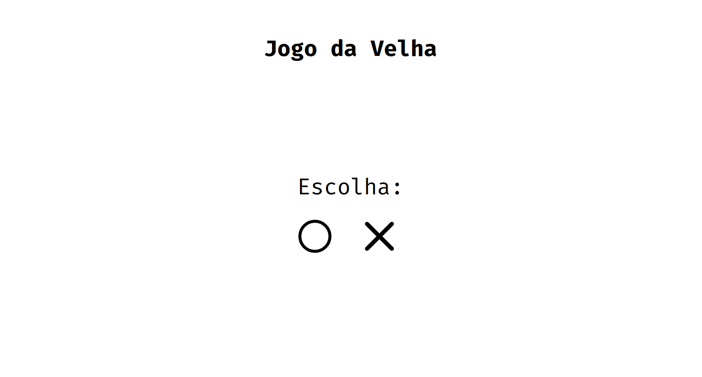

   
  

 

# Tic Tac Toe (Jogo da Velha!)  
Just a simple Tic Tac Toe implementation using Vue.js to present.

## About
This project was developed as a way to implement the <a href="https://en.wikipedia.org/wiki/Minimax" target="_blank">Minimax algorithm</a> in the Artificial Intelligence discipline.

If you want to test the application on your machine, just perform a 'clone' of this repository or simply download this repository. Then just open the <strong>index.html</strong> in your favorite browser.